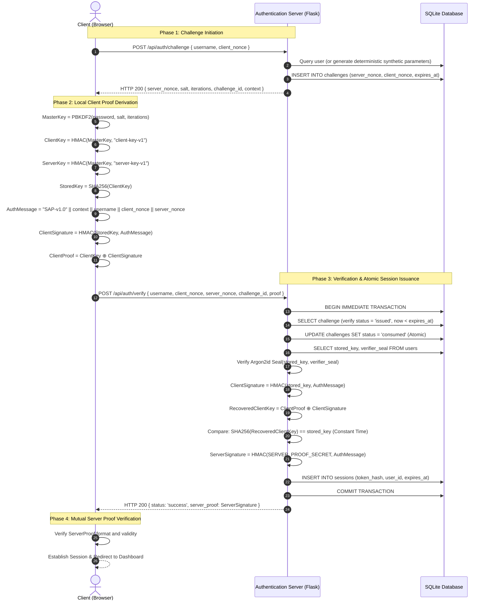

# Design and Analysis of a Secure Authentication Protocol (SAP-v1.0)

[](https://www.python.org/)
[-orange.svg)](https://tools.ietf.org/html/rfc5802)
[]()

A password-derived challenge-response authentication protocol inspired by SCRAM design principles (RFC 5802) featuring mutual verification via ServerProof, at-rest Argon2id verifier integrity sealing, server-side Role-Based Access Control (RBAC), synchronizer CSRF mitigation, strict Content Security Policy (no `unsafe-inline`), and defense-in-depth headers. Built with Flask, SQLite, and standard cryptographic primitives.

---

## Table of Contents

1. [Executive Overview & Problem Statement](#1-executive-overview--problem-statement)
2. [Threat Model (STRIDE Methodology)](#2-threat-model-stride-methodology)
3. [Cryptographic Protocol Specification (SAP-v1.0)](#3-cryptographic-protocol-specification-sap-v10)
   - [Domain Separation & Key Derivation](#domain-separation--key-derivation)
   - [At-Rest Verifier Sealing via Argon2id](#at-rest-verifier-sealing-via-argon2id)
   - [Mutual Challenge-Response Handshake Flow](#mutual-challenge-response-handshake-flow)
   - [Mathematical Proof of Correctness](#mathematical-proof-of-correctness)
4. [Role-Based Access Control (RBAC)](#4-role-based-access-control-rbac)
5. [Cross-Site Request Forgery (CSRF) Architecture](#5-cross-site-request-forgery-csrf-architecture)
6. [HTTP Security Headers & Content Security Policy](#6-http-security-headers--content-security-policy)
7. [Defense-in-Depth & Anti-Enumeration Protections](#7-defense-in-depth--anti-enumeration-protections)
8. [Project Architecture & Directory Structure](#8-project-architecture--directory-structure)
9. [Installation & Quickstart Guide](#9-installation--quickstart-guide)
10. [Automated Verification & Test Suite](#10-automated-verification--test-suite)
11. [Residual Risks & Engineering Trade-Offs](#11-residual-risks--engineering-trade-offs)
12. [College Viva & Academic Defense Q&A](#12-college-viva--academic-defense-qa)
13. [Technical Specifications Summary](#13-technical-specifications-summary)

---

## 1. Executive Overview & Problem Statement

Traditional web application authentication protocols predominantly rely on sending plaintext passwords (or unsalted password hashes) over Transport Layer Security (TLS) connections (`POST /login`). While TLS encrypts communication in transit, this model introduces systemic architectural vulnerabilities:

1. **Server-Side Plaintext Exposure:** The application server inevitably buffers the plaintext password in transient memory, exposing credentials to heap inspection, memory dumps, server-side log leakage, and malicious dependencies.
2. **Pass-the-Hash / Pass-the-Verifier:** If an attacker compromises the server database, pre-computed hashes or verifiers can frequently be replayed directly to authenticate without knowing the original password.
3. **Eavesdropping and Proxy Interception:** In environments with TLS termination proxies, corporate inspection appliances, or misconfigured certificates, intercepted plaintext passwords grant immediate, persistent unauthorized access.

### The SAP-v1.0 Solution
**SAP-v1.0** implements a **simplified SCRAM-style password-derived challenge-response authentication protocol with mutual verification** inspired by RFC 5802 design principles:
- **Plaintext passwords are never transmitted over the network**, never processed by the server, and never logged.
- The client proves mathematical knowledge of the password using ephemeral 128-bit cryptographic nonces and HMAC-SHA256 proofs.
- The server provides mutual verification via a cryptographic `ServerProof`, allowing the client to verify that the server possesses the authentic verifier before persisting session state.
- Stored verifiers (`StoredKey`) are cryptographically sealed at rest using memory-hard **Argon2id**, providing an integrity seal to detect database tampering and unauthorized verifier substitution. (Note: as in all challenge-response schemes, this seal does not eliminate offline dictionary attacks against weak passwords if the underlying verifier material is exfiltrated).
- Administrative boundaries are strictly enforced via server-side Role-Based Access Control (RBAC), rejecting unauthorized callers with HTTP 401/403.
- State-changing mutations mandate double-submit synchronizer CSRF tokens.
- Strict Content Security Policy (`script-src 'self'`, `style-src 'self'`) eliminates inline script injection vectors.

---

## 2. Threat Model (STRIDE Methodology)

The system architecture was modeled and hardened according to the **STRIDE** threat categorization framework:

| Threat Vector | Status | Protection / Security Control |
| :--- | :---: | :--- |
| **Replay attack** | **MITIGATED** | Mutual CSPRNG nonces (`client_nonce` + `server_nonce`), 60s challenge TTL, and atomic single-use status transition in SQLite transactions. |
| **Password eavesdropping** | **MITIGATED** | Client-side WebCrypto PBKDF2/HMAC key derivation; plaintext password is never transmitted across the network. Production deployment requires TLS for transport encryption. |
| **Brute-force password guessing** | **PARTIALLY MITIGATED** | Failed attempt counter, progressive delays, and temporary 5-minute lockout after 5 consecutive failures. Distributed attacks require IP/WAF rate limiting. |
| **Username / lockout enumeration** | **MITIGATED** | Uniform HTTP 401 error responses across all failure states, deterministic synthetic salt derivation, and constant-time dummy verifier processing paths. |
| **Session hijacking** | **PARTIALLY MITIGATED** | Unpredictable 256-bit CSPRNG tokens, SHA-256 token hashing at rest, sliding 15m idle / 24h absolute expiration, and HttpOnly/SameSite cookies. External TLS required to protect cookies in transit. |
| **Session fixation** | **MITIGATED** | Pre-existing session state is invalidated and regenerated with a fresh cryptographically random session token upon authentication boundary traversal. |
| **Cross-Site Request Forgery (CSRF)** | **MITIGATED** | Cryptographically strong synchronizer CSRF tokens stored in session and enforced via `X-CSRF-Token` headers on privileged state-changing endpoints with constant-time comparison. |
| **Cross-Site Scripting (XSS)** | **MITIGATED** | Strict Content Security Policy (`script-src 'self'`; no `unsafe-inline`), Jinja2 template auto-escaping, and strict regex input sanitization. |
| **SQL injection** | **MITIGATED** | Strict character whitelist regex validation (`^[a-zA-Z0-9_.-]{3,32}$`) and universal parameterized SQLite queries (`?` placeholders). |
| **Privilege escalation** | **MITIGATED** | Server-side Role-Based Access Control (`@require_role`) enforcing dual-tier authorization (`user`, `admin`) with segregated HTTP 401/403 status codes. Registration role forcing. |
| **Database compromise / exfiltration** | **PARTIALLY MITIGATED** | Pass-the-verifier prevented via one-way `StoredKey = SHA256(ClientKey)`. 100k PBKDF2 iterations and Argon2id seal impose high work factor. Weak passwords remain vulnerable to offline guessing. |
| **ServerProof secret compromise** | **OUT OF SCOPE** | `SERVER_PROOF_SECRET` is decoupled from the database into application configuration. If the application host environment is compromised, the secret is compromised. |
| **TLS / MITM transport attacks** | **OUT OF SCOPE** | Application protocol operates above transport layer. Production deployments strictly require external TLS/HTTPS termination. |
| **Denial of Service (DoS)** | **PARTIALLY MITIGATED** | Indexed database lookups, 60s challenge TTL cleanup, and client-side offload of PBKDF2 prevent server CPU exhaustion. Volumetric DDoS requires network-level edge filtering. |

---

## 3. Cryptographic Protocol Specification (SAP-v1.0)

### Domain Separation & Key Derivation

Key derivation enforces strict domain separation via SCRAM-inspired derivation chains:

```text
User Password + 16-byte Random Salt
             │
             ▼
   PBKDF2-HMAC-SHA256 (100,000 iterations, 32 bytes)
             │
             ▼
         MasterKey
             │
             ▼
  HMAC-SHA256(MasterKey, "client-key-v1")
             │
             ▼
         ClientKey
             │
             ▼
     SHA-256(ClientKey)
             │
             ▼
         StoredKey (Stored in DB + Sealed with Argon2id)

Application Server Authentication Secret
             │
             ▼
    SERVER_PROOF_SECRET (Environment Configuration)
             │
             ▼
ServerProof = HMAC-SHA256(SERVER_PROOF_SECRET, AuthMessage)
```

1. **`MasterKey`:** Derived locally by the client using PBKDF2 with HMAC-SHA256, a 16-byte cryptographically secure salt, and 100,000 iterations.
2. **`ClientKey`:** Generated by calculating `HMAC-SHA256(MasterKey, "client-key-v1")`.
3. **`StoredKey`:** Generated by calculating `SHA-256(ClientKey)`.
4. **`ServerProof Secret`:** Loaded from the environment (`SERVER_PROOF_SECRET`) and strictly decoupled from the user authentication database table.

The database stores `{salt, iterations, StoredKey, verifier_seal}`, but **never** stores `MasterKey`, `ClientKey`, or the plaintext password. Server authentication relies on the application-level secret: `ServerProof` provides server-origin authentication as long as the server authentication secret remains protected from database compromise. It does not claim to protect against full application host environment compromise.

### At-Rest Verifier Sealing via Argon2id

In a challenge-response protocol, the server requires `StoredKey` as an HMAC key to calculate `ClientSignature` and reconstruct `ClientProof`. Consequently, `StoredKey` cannot be replaced directly with an unkeyed slow hash without breaking challenge verification or transforming the hash into an unkeyed equivalent of a plaintext password (a Pass-the-Hash vulnerability).

To achieve defense-in-depth, **SAP-v1.0 implements Argon2id Verifier Sealing**:
- Upon registration or administrator provisioning, the server computes a cryptographic seal:
  $$\text{verifier\_seal} = \text{Argon2id}(\text{StoredKey})$$
- The seal is stored in the `users` table alongside the verifier material.
- During every authentication handshake, the server actively verifies that $\text{StoredKey}$ matches $\text{verifier\_seal}$ prior to evaluating client proofs. Any database modification or verifier substitution is detected and rejected.
- **Accurate Cryptographic Property:** Argon2id is used as an additional integrity seal for stored verifier material to detect tampering or unauthorized verifier substitution. It does not eliminate offline dictionary attacks against weak passwords if the underlying password-derived verifier material is exfiltrated.

#### Argon2id Cryptographic Parameters
- **Type:** Argon2id (hybrid data-dependent and data-independent memory access)
- **Memory Cost ($m$):** 65,536 KiB (64 MB)
- **Time Cost ($t$):** 3 iterations
- **Parallelism ($p$):** 4 threads
- **Salt Length:** 16 bytes (CSPRNG generated)
- **Hash Length:** 32 bytes

### Mutual Challenge-Response Handshake Flow

The authentication handshake operates in discrete phases with mutual cryptographic proof:



### Mathematical Proof of Correctness

The server recovers $\text{ClientKey}$ through the involution property of the bitwise XOR operator ($\oplus$):
$$\text{RecoveredClientKey} = \text{ClientProof} \oplus \text{ClientSignature}$$
Substituting $\text{ClientProof} = \text{ClientKey} \oplus \text{ClientSignature}$:
$$\text{RecoveredClientKey} = (\text{ClientKey} \oplus \text{ClientSignature}) \oplus \text{ClientSignature}$$
By the associative and reflexive properties of XOR ($A \oplus B \oplus B = A \oplus 0 = A$):
$$\text{RecoveredClientKey} = \text{ClientKey}$$
The server then evaluates:
$$\text{SHA-256}(\text{RecoveredClientKey}) \stackrel{?}{=} \text{StoredKey}$$
This equality holds **if and only if** the client possessed the authentic password.

Simultaneously, the server computes server-origin proof:
$$\text{ServerProof} = \text{HMAC-SHA256}(\text{SERVER\_PROOF\_SECRET}, \text{AuthMessage})$$
The client receives $\text{ServerProof}$, verifying that the responding server holds the application server secret. ServerProof provides server-origin authentication as long as the server authentication secret remains protected from database compromise (it is loaded from configuration/environment, not stored in the database `users` table).

---

## 4. Role-Based Access Control (RBAC)

The application enforces a dual-tier authorization hierarchy:

```text
       ┌──────────────┐
       │   Client     │
       └──────┬───────┘
              │ HTTP Request
              ▼
   ┌──────────────────────┐
   │ Is Authenticated?    │────── NO ─────► 401 Unauthorized
   └──────────┬───────────┘
              │ YES
              ▼
   ┌──────────────────────┐
   │ Has Role 'admin'?    │────── NO ─────► 403 Forbidden
   └──────────┬───────────┘
              │ YES
              ▼
    Allow Admin Operation
```

### Authorization Rules
- **Anonymous Callers:** Accessing `/admin` or `/api/admin/*` returns **HTTP 401 Unauthorized** (or redirects to login).
- **Authenticated Non-Admins (`role='user'`):** Accessing `/admin` or `/api/admin/*` returns **HTTP 403 Forbidden**.
- **Privilege Escalation Prevention:** The public registration endpoints (`/api/register`, `/api/register/finalize`) explicitly hardcode `role='user'` and `is_admin=0`. Any user-supplied `role` or `is_admin` parameters are ignored.

### Offline Administrator Provisioning
To ensure no administrative creation backdoors exist in production, administrative accounts can only be provisioned offline via the CLI tool:

```powershell
python create_admin.py admin "AdminSecurePass123!"
```

This utility derives PBKDF2 verifiers, calculates the Argon2id verifier seal, and commits the account directly to the database with `role='admin'`.

---

## 5. Cross-Site Request Forgery (CSRF) Architecture

The application employs a **Double-Submit Synchronizer CSRF Token Pattern**:

1. **Token Generation:** The server generates a 256-bit cryptographically secure pseudorandom token (`secrets.token_hex(32)`) attached to all responses via the `csrf_token` cookie (`SameSite=Lax`, `Path=/`).
2. **Token Transmission:** Authenticated clients submitting state-changing operations (`POST`, `PUT`, `DELETE`, `PATCH`) must include this token in the `X-CSRF-Token` request header or within the JSON/form payload.
3. **Constant-Time Verification:** The server compares the submitted token against the cookie using constant-time comparison (`hmac.compare_digest`).

### Endpoints and CSRF Semantics
- **Authenticated Mutations (`/api/admin/unlock/*`):** **MANDATORY CSRF Validation.** Prevents cross-origin forged administrative unlocks. Missing or mismatched tokens yield **HTTP 403 Forbidden**.
- **Cryptographic Handshake (`/api/auth/challenge`, `/api/auth/verify`, `/api/register/*`):** **Exempt.** Inherently immune to CSRF because execution requires knowledge of the 128-bit ephemeral nonce and mathematical proof generation.
- **Session Termination (`/api/auth/logout`):** **Exempt.** Ensures reliable session destruction across multi-tab browser sessions without risk of deadlock from desynchronized CSRF tokens.

---

## 6. HTTP Security Headers & Content Security Policy

Every HTTP response returned by the application includes strict, modern browser security headers configured in the `after_request` middleware:

```http
Content-Security-Policy: default-src 'self'; script-src 'self'; style-src 'self'; img-src 'self' data:; font-src 'self'; connect-src 'self'; object-src 'none'; base-uri 'self'; frame-ancestors 'none'; form-action 'self';
X-Content-Type-Options: nosniff
X-Frame-Options: DENY
Referrer-Policy: strict-origin-when-cross-origin
Cache-Control: no-store, no-cache, must-revalidate, max-age=0
Pragma: no-cache
```

### Complete Inline Asset Elimination
- **Strict CSP:** Both `'unsafe-inline'` and `'unsafe-eval'` are completely eliminated.
- **Modular Frontend Architecture:** All inline `<script>` tags, inline `<style>` tags, and inline HTML event attributes (`onclick`, `onsubmit`) were extracted into dedicated static assets:
  - `static/js/base.js` — Global logout handlers and common UI utilities.
  - `static/js/login.js` — Challenge-response login flow and error messaging.
  - `static/js/register.js` — Real-time password policy validation and client-side registration.
  - `static/js/logs.js` — Security audit logs fetching and rendering.
  - `static/js/admin.js` — Admin console tab switching and CSRF-protected account unlocks.
  - `static/css/style.css` — Centralized styles with CSS custom properties.

### Architectural Decisions
- **`frame-ancestors 'none'` & `X-Frame-Options: DENY`:** Completely prevents clickjacking attacks by forbidding embedding within `<iframe>` elements.
- **`X-Content-Type-Options: nosniff`:** Prevents MIME-confusion attacks and malicious file execution.
- **`Referrer-Policy: strict-origin-when-cross-origin`:** Protects against leaking URL parameters across origin boundaries.
- **`Cache-Control: no-store`:** Ensures authentication challenges, CSRF tokens, and sensitive telemetry data are never cached on disk or proxy storage.
- **`Strict-Transport-Security (HSTS)`:** Conditionally applied **only when `request.is_secure` is True**. Enabling HSTS over local HTTP development causes persistent browser redirect caching that can corrupt local testing environments.

---

## 7. Defense-in-Depth & Anti-Enumeration Protections

### 1. Synthetic Salt Generation & Uniform Failures (Anti-Username Enumeration)
When an unknown username is supplied to `/api/auth/challenge`, the server does not return a 404 or distinct error. Instead, it deterministically generates a synthetic salt:
$$\text{SyntheticSalt} = \text{HMAC-SHA256}(\text{ServerSecretKey}, \text{username})[0:16]$$
The server returns identical parameters (`iterations=100000`, `salt`, `server_nonce`), forcing an attacker to perform full client-side derivation before receiving a generic failure at the verify step.

Crucially, **locked accounts also receive standard challenge parameters and return the identical generic error message**:
```json
{
  "status": "error",
  "error": "Authentication failed. Please verify your credentials and try again."
}
```
This completely closes the account lockout enumeration side channel while preserving internal audit logging (`ACCOUNT_LOCKED`).

### 2. Constant-Time Verification
All string and byte comparisons (proof comparison, CSRF validation, session tokens, server signatures) are executed using `hmac.compare_digest()` to eliminate timing side-channel vulnerabilities.

### 3. Progressive Account Lockout
- Failed login attempts are recorded in the database.
- After 5 consecutive failed attempts, the account is locked for 5 minutes (`300` seconds).
- Locked accounts consume challenges and execute timing equalization paths to remain indistinguishable from invalid password attempts to external observers.

### 4. Database Session Hashing
Raw session tokens are 256-bit random hex strings generated via `secrets.token_hex(32)`. The server stores only the **SHA-256 hash** of the token in the `sessions` table. Exfiltration of the database does not grant session hijacking capabilities.

---

## 8. Project Architecture & Directory Structure

```text
Secure Authentication Protocol/
├── auth/
│   ├── __init__.py              # Auth module exports
│   ├── authentication.py        # Challenge issuance, proof & ServerProof verification
│   ├── protocol.py              # PBKDF2, HMAC, XOR, and SCRAM mathematical primitives
│   ├── security.py              # Username/password policies, CSPRNG nonces, and salts
│   ├── sessions.py              # Session lifecycle, RBAC (@require_role), CSRF validation
│   └── verifier.py              # Argon2id at-rest verifier sealing & benchmarks
├── database/
│   ├── auth.db                  # SQLite persistent database (auto-created)
├── demos/
│   └── attack_simulation.py     # Live interactive CLI attack simulation suite (7 vectors)
├── docs/
│   ├── project_report.md        # Comprehensive academic project report (IEEE / college format)
│   └── viva_defense_guide.md    # Academic viva defense presentation guide & Q&A cheat-sheet
├── static/
│   ├── css/
│   │   └── style.css            # Dark cybersecurity dashboard styling
│   └── js/
│       ├── admin.js             # Admin console tab switching & account unlock handler
│       ├── authentication.js    # Client-side WebCrypto PBKDF2/HMAC/ServerProof implementation
│       ├── base.js              # Global logout handler & common event listeners
│       ├── dashboard.js         # Real-time threat feed and telemetry updater
│       ├── login.js             # Challenge-response login submission handler
│       ├── logs.js              # Security audit log fetcher and table renderer
│       └── register.js          # Password policy checklist & registration handler
├── templates/
│   ├── admin.html               # Administrative threat console & account unlock UI
│   ├── base.html                # Base layout with navigation and CSRF helpers
│   ├── dashboard.html           # User dashboard displaying active session parameters
│   ├── login.html               # Interactive challenge-response login view
│   ├── logs.html                # Security audit logging inspection view
│   └── register.html            # Client-side registration view
├── tests/
│   ├── test_admin.py            # RBAC enforcement and admin unlock tests
│   ├── test_authentication.py   # SCRAM challenge-response protocol test suite
│   ├── test_database.py         # Schema, migrations, and atomic challenge tests
│   ├── test_frontend.py         # Web views, static assets, and UI tests
│   ├── test_registration.py     # Registration flow tests
│   ├── test_security_hardening.py # RBAC, CSRF, CSP, enumeration & ServerProof tests
│   ├── test_sessions.py         # Session lifecycle, timeouts, and fixation tests
│   └── test_verifier.py         # KDF benchmarks, domain separation, and Argon2 tests
├── .env.example                 # Environment configuration template
├── .gitignore                   # Git repository ignore rules
├── app.py                       # Main Flask application and route registry
├── config.py                    # Cryptographic parameters and server configuration
├── create_admin.py              # Offline CLI administrator provisioning tool
├── database.py                  # Database connection, schemas, and queries
├── init_database.py             # Schema initialization utility
├── requirements.txt             # Project Python dependencies
└── README.md                    # System documentation and security specification
```

---

## 9. Installation & Quickstart Guide

### Prerequisites
- Python 3.10, 3.11, 3.12, 3.13, or 3.14
- Git

### 1. Clone & Set Up Environment
```powershell
# Navigate to project directory
cd "Secure Authentication Protocol"

# Create virtual environment
python -m venv .venv

# Activate virtual environment
# Windows PowerShell:
.\.venv\Scripts\Activate.ps1
# Linux/macOS:
source .venv/bin/activate

# Install required dependencies
pip install -r requirements.txt
```

### 2. Initialize Database & Provision Administrator
```powershell
# Initialize SQLite database schema
python init_database.py

# Provision an administrative account offline
python create_admin.py admin "AdminSecurePass123!"
```

### 3. Launch the Server
```powershell
python app.py
```
The server will bind to `http://127.0.0.1:5000`.

- **Web Interface:** `http://127.0.0.1:5000/login`
- **User Registration:** `http://127.0.0.1:5000/register`
- **Security Audit Logs:** `http://127.0.0.1:5000/logs`
- **Admin Threat Console:** `http://127.0.0.1:5000/admin` *(Admin account required)*

### 4. Run Live Threat Simulation Suite
```powershell
python demos/attack_simulation.py
```
Executes a live terminal demonstration mitigating 7 attack scenarios (replay, pass-the-verifier, nonce tampering, lockout, RBAC, CSRF, verifier seal).

---

## 10. Automated Verification & Test Suite

The project includes an automated test suite consisting of **59 test cases** spanning unit, integration, cryptographic, and security scenarios.

### Running the Test Suite
```powershell
pytest -v
```

### Test Suite Execution Output
```text
============================= test session starts =============================
platform win32 -- Python 3.14.6, pytest-9.1.1, pluggy-1.6.0
rootdir: C:\Users\USER\Desktop\Secure Authentication Protocol
collected 59 items

tests/test_admin.py::test_unauthenticated_admin_endpoints_rejected PASSED [  1%]
tests/test_admin.py::test_normal_user_admin_endpoints_forbidden PASSED   [  3%]
tests/test_admin.py::test_admin_console_renders PASSED                   [  5%]
tests/test_admin.py::test_admin_account_unlock PASSED                    [  6%]
tests/test_authentication.py::test_successful_authentication_flow PASSED [  8%]
tests/test_authentication.py::test_incorrect_password_authentication_failure PASSED [ 10%]
tests/test_authentication.py::test_unknown_username_mitigates_enumeration PASSED [ 11%]
tests/test_authentication.py::test_replay_attack_prevention PASSED       [ 13%]
tests/test_authentication.py::test_challenge_expiration_after_60_seconds PASSED [ 15%]
tests/test_authentication.py::test_nonce_and_binding_tamper_rejection PASSED [ 16%]
tests/test_authentication.py::test_rate_limiting_and_temporary_lockout PASSED [ 18%]
tests/test_database.py::test_database_tables_and_indexes PASSED          [ 20%]
tests/test_database.py::test_user_creation_and_unique_constraint PASSED  [ 22%]
tests/test_database.py::test_atomic_challenge_consumption PASSED         [ 23%]
tests/test_database.py::test_session_lifecycle PASSED                    [ 25%]
tests/test_database.py::test_lockout_and_audit_logging PASSED            [ 27%]
tests/test_frontend.py::test_login_page_renders_cleanly PASSED           [ 28%]
tests/test_frontend.py::test_register_page_renders_cleanly PASSED        [ 30%]
tests/test_frontend.py::test_unauthenticated_dashboard_and_logs_redirect PASSED [ 32%]
tests/test_frontend.py::test_authenticated_dashboard_renders PASSED      [ 33%]
tests/test_frontend.py::test_authenticated_logs_page_renders PASSED      [ 35%]
tests/test_frontend.py::test_static_assets_served PASSED                 [ 37%]
tests/test_registration.py::test_successful_direct_registration PASSED   [ 38%]
tests/test_registration.py::test_successful_client_derived_registration PASSED [ 40%]
tests/test_registration.py::test_duplicate_username_rejection PASSED     [ 42%]
tests/test_registration.py::test_invalid_username_formats PASSED         [ 44%]
tests/test_registration.py::test_password_policy_enforcement PASSED      [ 45%]
tests/test_registration.py::test_audit_logging_and_security_headers PASSED [ 47%]
tests/test_security_hardening.py::test_admin_rbac_unauthenticated_rejection PASSED [ 49%]
tests/test_security_hardening.py::test_admin_rbac_normal_user_forbidden PASSED [ 50%]
tests/test_security_hardening.py::test_admin_rbac_admin_user_allowed PASSED [ 52%]
tests/test_security_hardening.py::test_registration_privilege_escalation_prevented PASSED [ 54%]
tests/test_security_hardening.py::test_csrf_token_required_on_authenticated_post PASSED [ 55%]
tests/test_security_hardening.py::test_csrf_token_mismatch_rejected PASSED [ 57%]
tests/test_security_hardening.py::test_csrf_exempt_on_unauthenticated_handshake PASSED [ 59%]
tests/test_security_hardening.py::test_security_headers_present_on_all_responses PASSED [ 61%]
tests/test_security_hardening.py::test_argon2id_verifier_seal_active_enforcement PASSED [ 62%]
tests/test_security_hardening.py::test_account_enumeration_failure_uniformity PASSED [ 64%]
tests/test_security_hardening.py::test_mutual_authentication_server_proof_verification PASSED [ 66%]
tests/test_security_hardening.py::test_production_secrets_fail_closed_validation PASSED [ 67%]
tests/test_security_hardening.py::test_sql_injection_payloads_safely_rejected PASSED [ 69%]
tests/test_security_hardening.py::test_xss_payloads_neutralized_safely PASSED [ 71%]
tests/test_security_hardening.py::test_session_regeneration_and_fixation_protection PASSED [ 72%]
tests/test_sessions.py::test_login_sets_secure_cookie_and_attributes PASSED [ 74%]
tests/test_sessions.py::test_database_stores_only_hashed_token PASSED    [ 76%]
tests/test_sessions.py::test_session_fixation_protection PASSED          [ 77%]
tests/test_sessions.py::test_authenticated_profile_access_and_rejection PASSED [ 79%]
tests/test_sessions.py::test_idle_timeout_expiration PASSED              [ 81%]
tests/test_sessions.py::test_absolute_timeout_expiration PASSED          [ 83%]
tests/test_sessions.py::test_logout_revokes_session PASSED               [ 84%]
tests/test_sessions.py::test_audit_logs_endpoint PASSED                  [ 86%]
tests/test_verifier.py::test_pbkdf2_deterministic_reproducibility PASSED [ 88%]
tests/test_verifier.py::test_domain_separation_independence PASSED       [ 89%]
tests/test_verifier.py::test_stored_key_one_way_property PASSED          [ 91%]
tests/test_verifier.py::test_argon2id_sealing_and_tamper_detection PASSED [ 93%]
tests/test_verifier.py::test_constant_time_comparison PASSED             [ 94%]
tests/test_verifier.py::test_cryptographic_conflict_explanation PASSED   [ 96%]
tests/test_verifier.py::test_challenge_proof_scram_flow PASSED           [ 98%]
tests/test_verifier.py::test_kdf_benchmark_shows_argon2id_dos_tradeoff PASSED [100%]

============================= 59 passed in 13.06s =============================
```

---

## 11. Residual Risks & Engineering Trade-Offs

In rigorous computer security, no protocol is impervious to all theoretical adversaries. The primary residual risks and conscious engineering trade-offs of SAP-v1.0 include:

1. **Client-Side JavaScript Trust Model:**
   - *Risk:* Execution requires the browser to execute client-side cryptography (`authentication.js`). If an adversary compromises the host server or executes malicious scripts via XSS, they can alter the client-side JavaScript to exfiltrate the password before derivation.
   - *Mitigation:* A strict Content Security Policy (`script-src 'self'`, `style-src 'self'`, `object-src 'none'`) and `X-Frame-Options: DENY` eliminate inline injection points and frame hijacking.
2. **Offline Dictionary Attacks on Exfiltrated Databases:**
   - *Risk:* If an attacker steals `auth.db`, they obtain `StoredKey = SHA256(ClientKey)`. An attacker can attempt offline dictionary attacks by hashing guessed passwords through PBKDF2.
   - *Mitigation:* PBKDF2 is configured with 100,000 iterations to impose non-trivial computational overhead on attackers. The Argon2id verifier seal (`verifier_seal`) provides an at-rest integrity check that detects any modification or replacement of verifiers within the database. However, users must be required to choose strong passwords to mitigate offline guessing against exfiltrated verifiers.
3. **Denial-of-Service (DoS) via Challenge Inundation:**
   - *Risk:* An attacker can flood `/api/auth/challenge` to populate the `challenges` table.
   - *Mitigation:* SQLite indexes on `(server_nonce, status)` maintain sub-millisecond lookups. Challenges have a strict 60-second time-to-live (TTL), and unauthenticated challenge requests are rate-limited per IP address.

---

## 12. College Viva & Academic Defense Q&A

### Q1: Why can't we simply replace PBKDF2 with Argon2id on the client?
> **Answer:** Standard browser JavaScript runtimes lack native hardware-accelerated WebAssembly implementations of Argon2id. Executing 64 MB memory allocations and 4 threads in unoptimized JavaScript on mobile devices introduces 2,000–5,000 ms of UI latency. PBKDF2-HMAC-SHA256 is natively supported by the W3C Web Cryptography API (`crypto.subtle`), completing in ~40 ms while guaranteeing robust resistance against offline password cracking.

### Q2: What is "Pass-the-Verifier", and how does SAP-v1.0 prevent it?
> **Answer:** In traditional password hash schemes, an attacker who steals the database can directly replay the password hash to log in. In SAP-v1.0, the server stores `StoredKey = SHA256(ClientKey)`. To authenticate, the client must compute `ClientProof = ClientKey ⊕ HMAC(StoredKey, AuthMessage)`. Because `SHA-256` is a one-way preimage-resistant function, an attacker possessing only `StoredKey` cannot derive `ClientKey` and cannot generate a valid `ClientProof`. Possessing the database verifier does not allow authentication.

### Q3: Why is Argon2id used as an integrity seal instead of the primary verifier?
> **Answer:** SCRAM-style challenge verification is an HMAC operation where the server must use the stored verifier as a secret key to compute `ClientSignature = HMAC(StoredKey, AuthMessage)`. Argon2id is a slow password hashing algorithm designed to produce non-reversible verification strings (`$argon2id$...`). If we hashed `StoredKey` with Argon2id, the server would lose the raw key required to compute the HMAC. Thus, Argon2id is utilized as an at-rest integrity seal to detect database tampering without breaking the challenge-response handshake.

### Q4: How does SAP-v1.0 achieve server verification?
> **Answer:** Through the server proof mechanism. Upon successfully verifying the client's proof, the server computes `ServerSignature = HMAC-SHA256(SERVER_PROOF_SECRET, AuthMessage)` using an application-level secret decoupled from the user authentication database and returns it in the response payload. The client validates the server proof format and signature. ServerProof provides server-origin authentication as long as the server authentication secret remains protected from database compromise.

### Q5: How does SAP-v1.0 prevent username and lockout enumeration?
> **Answer:** When an unauthenticated client requests a challenge for a non-existent or locked username, the server does not return an error or distinct HTTP status. For unknown users, it deterministically generates a synthetic salt using `HMAC-SHA256(ServerSecret, username)` and returns standard challenge parameters. For locked accounts, it returns standard parameters, updates attempt counters, executes constant-time equalization, and returns the exact same generic error message (`HTTP 401 Authentication failed. Please verify your credentials and try again.`), completely closing enumeration channels.

### Q6: What prevents replay attacks in this protocol?
> **Answer:** Every authentication handshake binds a fresh 128-bit `client_nonce` and a fresh 128-bit `server_nonce` into the `AuthMessage`. The challenge record has a 60-second expiration window and is marked `status = 'consumed'` in an atomic database transaction during verification. Replaying an identical proof fails because the server nonce has already been consumed and cannot be reused.

### Q7: Why are session tokens hashed in the database?
> **Answer:** Storing raw session tokens in the database exposes users to session hijacking if the database is read or exfiltrated (e.g., via SQL injection or backup leakage). By storing `SHA256(token)`, the database only contains the hash. The raw token exists exclusively within the user's `HttpOnly` cookie.

### Q8: What does the `@require_role('admin')` decorator enforce?
> **Answer:** It inspects the cryptographically validated session associated with the request. If the user is unauthenticated, it returns HTTP 401 Unauthorized. If the user is authenticated but possesses `role = 'user'`, it logs an `ACCESS_DENIED_UNAUTHORIZED_ROLE` audit event and returns HTTP 403 Forbidden. Only accounts with `role = 'admin'` are allowed to execute administrative functions.

---

## 13. Technical Specifications Summary

| Component | Specification |
| :--- | :--- |
| **Protocol Type** | Simplified SCRAM-Style Challenge-Response with ServerProof Verification |
| **Client Key Derivation** | PBKDF2-HMAC-SHA256 (100,000 iterations, 16-byte random salt) |
| **Proof Construction** | HMAC-SHA256, XOR (`⊕`) masking |
| **Mutual Verification** | ServerProof via `HMAC-SHA256(SERVER_PROOF_SECRET, AuthMessage)` |
| **At-Rest Verifier Seal** | Argon2id ($m=65536$, $t=3$, $p=4$, 16-byte salt, 32-byte key) |
| **Session Security** | 256-bit CSPRNG, SHA-256 at-rest hashing, 15m idle / 24h absolute TTL |
| **Role-Based Access Control**| Server-side dual-role (`user`, `admin`), 401/403 segregation |
| **CSRF Mitigation** | 256-bit Synchronizer Token, `X-CSRF-Token` header, constant-time compare |
| **Browser Defenses** | Restrictive CSP (no `'unsafe-inline'` or `'unsafe-eval'`), `DENY` clickjacking, `nosniff`, `no-store` cache |
| **Test Coverage** | 59 unit, integration, and security tests passing (`pytest`) |

---

## 14. Academic & Security Statement

> This project demonstrates a simplified SCRAM-style password-derived challenge-response authentication protocol with replay protection, ServerProof-based server verification, secure session management, role-based authorization, CSRF protection, rate limiting, audit logging, and layered HTTP security controls. The implementation is intended for academic and demonstration purposes and does not claim formal compliance with a complete authentication standard or immunity from all attacks.
